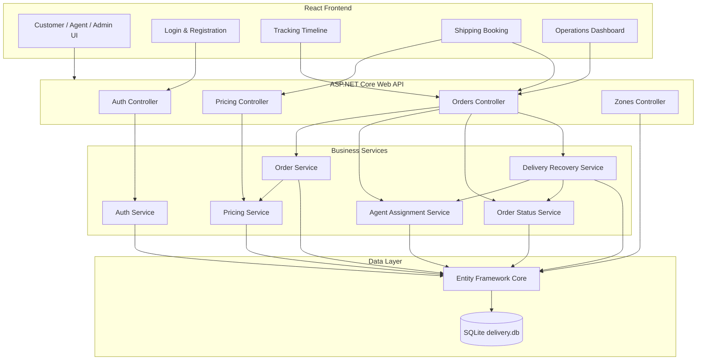
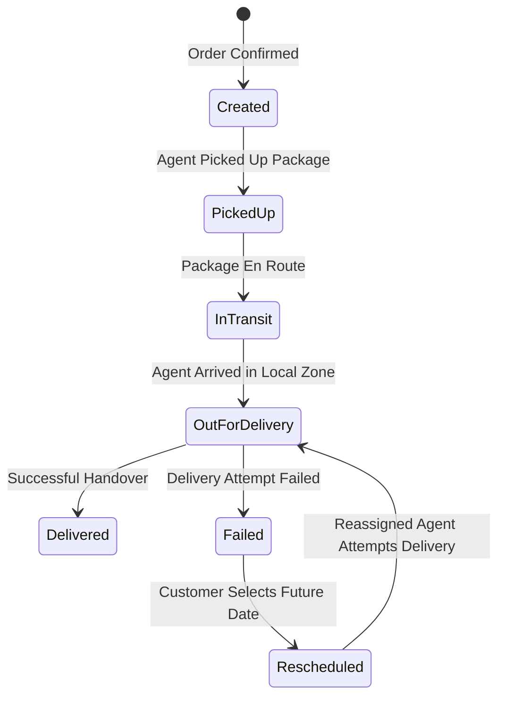
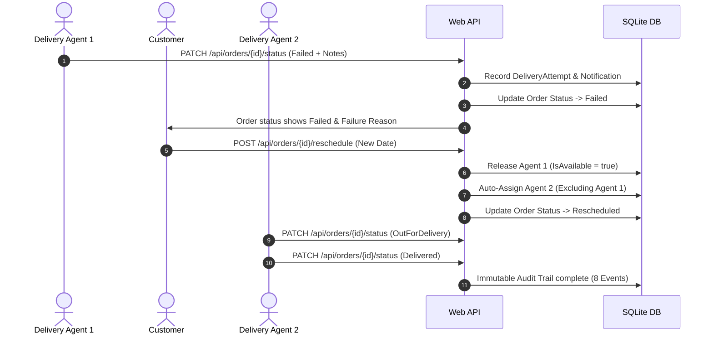
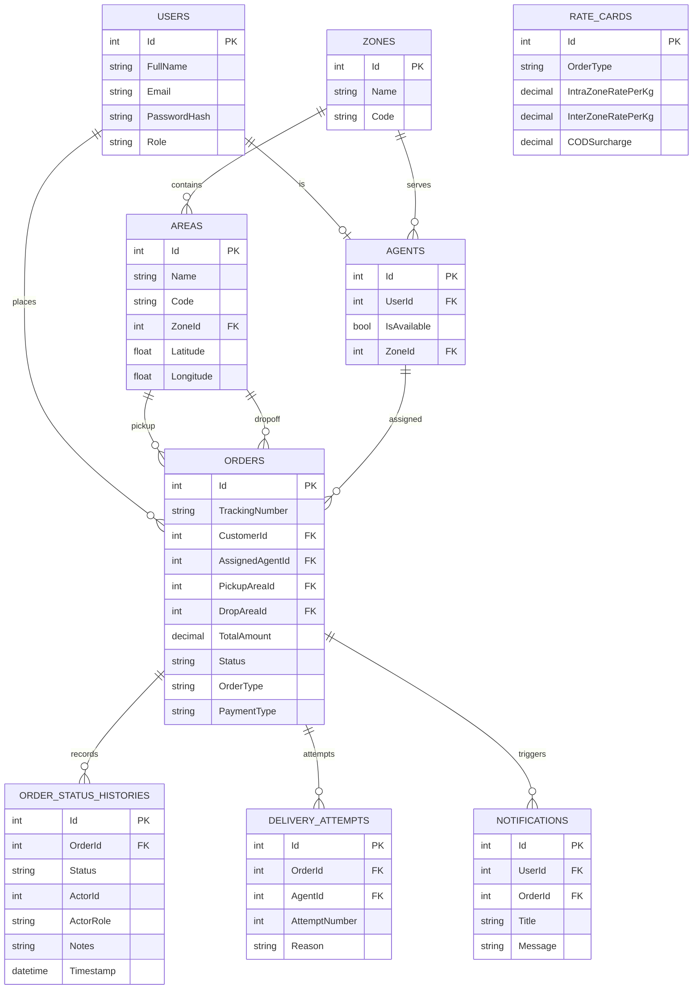

# DeliveryTracker

## Last-Mile Delivery Management Platform

DeliveryTracker is a full-stack last-mile delivery management platform designed to manage the complete delivery lifecycle — from price calculation and order creation to agent assignment, delivery tracking, failed-delivery recovery, rescheduling, and final delivery.

The system is built around a RESTful ASP.NET Core backend, EF Core with SQLite, JWT-based role authorization, and a React + TypeScript operations interface.

The main focus of the project is not just CRUD operations, but implementing the business rules behind a real delivery workflow:

- Database-driven shipping rates
- Volumetric and chargeable weight calculation
- Intra-zone and inter-zone pricing
- B2B / B2C pricing
- COD surcharges
- Intelligent delivery-agent assignment
- Agent availability management
- Haversine distance calculation
- Controlled order status transitions
- Immutable delivery tracking history
- Failed delivery attempts
- Customer rescheduling
- Automatic agent reassignment
- Transactional recovery
- JWT authentication and role-based authorization

---

## Table of Contents

- [Overview](#overview)
- [Key Features](#key-features)
- [Screenshots](#screenshots)
- [Engineering Problems Solved](#engineering-problems-solved)
- [System Architecture](#system-architecture)
- [Order Lifecycle](#order-lifecycle)
- [Failed Delivery Recovery](#failed-delivery-recovery)
- [Pricing Engine](#pricing-engine)
- [Agent Assignment](#agent-assignment)
- [Database Design](#database-design)
- [API Overview](#api-overview)
- [Authentication and Authorization](#authentication-and-authorization)
- [Frontend](#frontend)
- [Technology Stack](#technology-stack)
- [Project Structure](#project-structure)
- [Getting Started](#getting-started)
- [Demo Accounts](#demo-accounts)
- [Testing](#testing)
- [End-to-End Workflow](#end-to-end-workflow)
- [Design Decisions](#design-decisions)
- [Future Improvements](#future-improvements)

---

# Overview

DeliveryTracker models a simplified but realistic last-mile delivery operation.

A customer can create a shipment by providing:
- Pickup area
- Drop area
- Package dimensions
- Actual weight
- Order type
- Payment type

Before creating the order, the system calculates the shipping price using the configured rate card.

Once the order is created, an administrator can assign an available delivery agent. The agent then progresses the order through a controlled state machine.

If delivery fails, the system records the failed attempt, creates a customer notification, allows the customer to reschedule, releases the previous agent, and assigns another available agent.

Every status transition is permanently recorded in an immutable tracking history.

---

# Key Features

## Customer
- Register and login with JWT authentication
- Create delivery orders with dynamic area selection
- Preview shipping price before confirmation
- View personal orders with claim-based privacy scoping
- Track real-time delivery history and assigned delivery agent
- Inspect package dimensions, chargeable weight, and fee breakdown
- Reschedule failed deliveries for future dates

## Delivery Agent
- Login using JWT
- View assigned deliveries strictly scoped to assigned agent ID
- View order details and delivery addresses
- Update delivery status (`Created` &rarr; `PickedUp` &rarr; `InTransit` &rarr; `OutForDelivery` &rarr; `Delivered`)
- Report failed delivery attempts with mandatory failure reason notes
- Continue delivery after reassignment

## Admin
- View all system orders across customers and agents
- View complete order history and audit trails
- Trigger automatic agent assignment using nearest-agent Haversine algorithm
- Monitor operational metrics (Total, Active, Failed, Delivered)
- Inspect failed and rescheduled orders

## Backend Engineering
- ASP.NET Core Web API (.NET 10)
- Entity Framework Core with SQLite migrations (`Migrate()`)
- Database-driven configurable rate cards
- JWT authentication (`sub`, `email`, `role` claims)
- Password hashing via `PasswordHasher<User>`
- Service-based architecture with transactional rollback fail-safes
- Append-only immutable status history audit trail

---

# Screenshots

| Login | Create Delivery |
| :---: | :---: |
|  |  |

| Order Tracking Timeline | Admin Operations Console |
| :---: | :---: |
|  |  |

---

# Engineering Problems Solved

This project was built to demonstrate correct implementation of backend business rules, not just CRUD endpoints. The following problems required deliberate engineering decisions:

- **Pricing consistency**: Price preview (`POST /api/orders/calculate-price`) and order creation both call the same `PricingService`, so a customer can never be charged a different amount than what was quoted.
- **Assignment correctness**: Agents are filtered by `IsAvailable == true`, ranked by same-zone preference, then ordered by Haversine distance from the pickup area. This guarantees the nearest available agent is always selected.
- **Workflow integrity**: Invalid delivery status jumps (e.g. `Created → Delivered`) are rejected at the service layer by a validated transition table. The API never silently accepts illegal transitions.
- **Auditability**: Every status change appends a new immutable row to `OrderStatusHistories` with actor identity, actor role, notes, and timestamp. Status is never overwritten.
- **Failure recovery safety**: When a delivery is rescheduled, the previous agent is released (`IsAvailable = true`) and excluded from reassignment by `excludeAgentId`. This prevents the same failed agent from being reassigned to the same order.
- **Authorization boundaries**: `CustomerId` and `AgentId` are derived exclusively from authenticated JWT claims (`sub`), never from client-supplied request parameters. A customer cannot access another customer's orders, and an agent cannot update a delivery assigned to a different agent.

---

# System Architecture

The application follows a clean layered architecture.



---

# Order Lifecycle

The status of a delivery order follows a strict state machine pattern enforced by `OrderStatusService`.



### Valid Transitions
1. `Created` &rarr; `PickedUp` (Allowed: Agent, Admin)
2. `PickedUp` &rarr; `InTransit` (Allowed: Agent, Admin)
3. `InTransit` &rarr; `OutForDelivery` (Allowed: Agent, Admin)
4. `OutForDelivery` &rarr; `Delivered` (Allowed: Agent, Admin)
5. `OutForDelivery` &rarr; `Failed` (Allowed: Agent, Admin; requires notes)
6. `Failed` &rarr; `Rescheduled` (Allowed: Customer, Admin; requires future date)
7. `Rescheduled` &rarr; `OutForDelivery` (Allowed: Agent, Admin)

---

# Failed Delivery Recovery

When a delivery attempt fails, `DeliveryRecoveryService` handles the recovery workflow transactionally:



---

# Pricing Engine

The pricing engine calculates shipping costs dynamically based on database-driven `RateCards`.

### Weight Rules
- **Volumetric Weight**:
  $$\text{Volumetric Weight (kg)} = \frac{\text{Length (cm)} \times \text{Width (cm)} \times \text{Height (cm)}}{5000}$$
- **Chargeable Weight**:
  $$\text{Chargeable Weight} = \max(\text{Actual Weight}, \text{Volumetric Weight})$$

### Rate Card Lookup
- Fetches a `RateCard` row matching the order's `OrderType` (`B2C` or `B2B`).
- Determines the applicable rate: **IntraZone** (`IntraZoneRatePerKg`) when pickup and drop areas share the same zone, **InterZone** (`InterZoneRatePerKg`) otherwise.
- If `PaymentType == COD`, adds a fixed `CODSurcharge` amount configured in the `RateCard` (e.g. ₹40.00 flat).

$$\text{Delivery Fee} = \text{Chargeable Weight} \times \text{RatePerKg}$$

$$\text{Total Amount} = \text{Delivery Fee} + \text{CODSurcharge}$$

The price calculation is shared between the `/calculate-price` endpoint and order creation, ensuring the customer is always charged the same amount that was quoted.

---

# Agent Assignment

The intelligent agent assignment algorithm operates via `AgentAssignmentService`:

1. **Availability Filter**: Queries `Agents` where `IsAvailable == true`.
2. **Exclusion Check**: During rescheduling, accepts `excludeAgentId` to skip previous failed agents.
3. **Same-Zone Preference**: Prioritizes agents located in the order's pickup zone.
4. **Distance Tie-Breaker**: Uses the Haversine formula to compute exact distance between agent coordinates $(lat_1, lon_1)$ and pickup area coordinates $(lat_2, lon_2)$:
   $$d = 2r \arcsin \left( \sqrt{ \sin^2\left(\frac{\Delta \phi}{2}\right) + \cos(\phi_1)\cos(\phi_2)\sin^2\left(\frac{\Delta \lambda}{2}\right) } \right)$$
5. **State Mutation**: Marks assigned agent `IsAvailable = false` and links agent to order.

---

# Database Design

The database schema is managed via Entity Framework Core migrations on SQLite (`delivery.db`).



---

# API Overview

| Endpoint | Method | Roles | Description |
| :--- | :--- | :--- | :--- |
| `/api/auth/register` | `POST` | Public | Register customer account. |
| `/api/auth/login` | `POST` | Public | Authenticate and receive JWT Bearer token. |
| `/api/zones` | `GET` | Public | List all zones and areas. |
| `/api/orders/calculate-price` | `POST` | Public | Preview shipping rate calculation. |
| `/api/orders` | `POST` | Customer, Admin | Create new delivery order (JWT derives `CustomerId`). |
| `/api/orders` | `GET` | Customer, Agent, Admin | List orders (Scoped by user role). |
| `/api/orders/{id}` | `GET` | Customer, Agent, Admin | Get order details (Privacy protected). |
| `/api/orders/{id}/status` | `PATCH` | Agent, Admin | Advance order status in state machine. |
| `/api/orders/{id}/reschedule` | `POST` | Customer, Admin | Reschedule failed order for future date. |
| `/api/orders/{id}/auto-assign` | `POST` | Admin | Trigger intelligent agent auto-assignment. |

---

# Authentication and Authorization

- **JWT Tokens**: Signed with HMAC-SHA256 containing `sub` (User ID), `email`, and `role` claims.
- **Password Security**: Passwords hashed using ASP.NET Core `PasswordHasher<User>`.
- **Role Permissions**:
  - `Customer`: Can create orders, view own orders, and reschedule own failed orders.
  - `Agent`: Can view assigned deliveries and update status of assigned orders.
  - `Admin`: Can view all orders and trigger agent auto-assignment.

---

# Frontend

Built with Vite, React 19, TypeScript, and Lucide Icons. Designed with an operational slate design system (`src/index.css`) optimized for information density, scannability, and real-time tracking audit trails.

Key views include:
- Operational Login with quick evaluator demo buttons.
- 4-step shipping booking flow with live price estimation.
- Primary product order detail view with signature vertical tracking timeline.
- Compact operations tables with live search and status filters.

---

# Technology Stack

- **Backend**: C# / .NET 10, ASP.NET Core Web API
- **Data Access**: Entity Framework Core 10, SQLite
- **Security**: JWT Bearer (`Microsoft.AspNetCore.Authentication.JwtBearer`), `PasswordHasher<User>`
- **Testing**: xUnit test framework (55 automated tests)
- **Frontend**: React 19, TypeScript, Vite, Lucide React, Vanilla CSS design tokens

---

# Project Structure

```text
DeliveryTracker/
├── DeliveryTracker.API/            # ASP.NET Core Web API
│   ├── Controllers/               # REST API Endpoints
│   ├── Data/                      # DbContext & EF Migrations
│   ├── DTOs/                      # Request & Response Contracts
│   ├── Models/                    # Entity Models
│   ├── Services/                  # Business Logic & Algorithms
│   ├── appsettings.json           # JWT & DB Configuration
│   └── Program.cs                 # DI & Pipeline Setup
├── DeliveryTracker.Tests/          # xUnit Test Suite (55 Tests)
│   ├── AuthServiceTests.cs
│   ├── DeliveryRecoveryServiceTests.cs
│   ├── OrderStatusServiceTests.cs
│   ├── PricingServiceTests.cs
│   └── AgentAssignmentServiceTests.cs
└── DeliveryTracker.Web/            # React + TypeScript Frontend
    ├── src/
    │   ├── api/                   # Centralized API Client
    │   ├── components/            # Timeline, StatusBadge, Layout, Modals
    │   ├── context/               # AuthContext
    │   ├── pages/                 # Booking, Detail, Console, Auth
    │   └── types/                 # Domain Interfaces
    ├── index.html
    └── package.json
```

---

# Getting Started

### Prerequisites
- [.NET 10 SDK](https://dotnet.microsoft.com/download)
- [Node.js (v18+) & npm](https://nodejs.org/)

### 1. Run Backend Web API
```bash
cd DeliveryTracker.API
dotnet run --urls "http://localhost:5055"
```
The API server will automatically apply EF migrations, seed master data, and start on `http://localhost:5055`. You can inspect Swagger UI at `http://localhost:5055/swagger`.

### 2. Run React Frontend
```bash
cd DeliveryTracker.Web
npm install
npm run dev
```
Open your browser to `http://localhost:5173`.

---

# Demo Accounts

The database is seeded with preset demo accounts for evaluation:

| Role | Email | Password | Allowed Capabilities |
| :--- | :--- | :--- | :--- |
| **Customer** | `customer@delivery.com` | `Customer@123` | Create orders, view personal orders, reschedule failed orders. |
| **Agent 1** | `agent1@delivery.com` | `Agent@123` | View assigned orders, update status of assigned deliveries. |
| **Agent 2** | `agent2@delivery.com` | `Agent@123` | View assigned orders, handle reassigned deliveries. |
| **Admin** | `admin@delivery.com` | `Admin@123` | Access operations console, view all system orders, trigger auto-assign. |

---

# Testing

### Automated Unit Tests (`dotnet test`)
Run the backend test suite:
```bash
cd DeliveryTracker.Tests
dotnet test
```
All **55 unit tests** test pricing calculations, agent assignment, state transitions, failed recovery, and JWT authorization rules.

### Production Build Verification
```bash
cd DeliveryTracker.Web
npm run build
```

---

# End-to-End Workflow

To experience the full business lifecycle:

1. **Login as Customer** (`customer@delivery.com` / `Customer@123`).
2. **Book Delivery**: Select Colaba &rarr; Andheri, 25&times;15&times;10 cm, 3.5 kg, B2C + COD. Click **Calculate Quote** (₹250.00), then **Confirm Delivery**. Receive tracking number `LM-YYYYMMDD-XXXXXX`.
3. **Login as Admin** (`admin@delivery.com` / `Admin@123`). Go to **Operations Console**, locate order, click **Auto Assign**. Agent 1 (`Raj Agent`) is assigned.
4. **Login as Agent 1** (`agent1@delivery.com` / `Agent@123`). Advance status `PickedUp` &rarr; `InTransit` &rarr; `OutForDelivery` &rarr; `Failed` (Notes: "Customer phone unreachable").
5. **Login as Customer**: Open order detail. See `Failed` status. Click **Reschedule Delivery**, pick future date. Order updates to `Rescheduled` and auto-reassigns Agent 2 (`Vikram Agent`).
6. **Login as Agent 2** (`agent2@delivery.com` / `Agent@123`). Advance status `OutForDelivery` &rarr; `Delivered`.
7. **Verify Complete Audit Trail**: Order timeline displays all 8 immutable status history events.

---

# Design Decisions

- **SQLite Database**: Self-contained file database enabling instant grading without external database server installation.
- **EF Core Migrations**: Database schema controlled strictly via EF migrations (`Database.Migrate()`) rather than `EnsureCreated()`.
- **JWT Claim Scoping**: `CustomerId` and `AgentId` derived from authenticated JWT claims (`sub`), preventing cross-customer data tampering.
- **Immutable Status Audit Trail**: Status changes are recorded in append-only `OrderStatusHistory` table rather than updating inline strings.
- **Operational UI Aesthetics**: Focused UI built with Vanilla CSS tokens, precise typography, dark slate palette, and zero generic marketing templates.

---

# Future Improvements

- Real-time WebSockets / SignalR delivery updates.
- Interactive map visualization for agent live GPS tracking.
- Webhook notifications for customer SMS / WhatsApp updates.
- Dynamic route optimization for multi-stop delivery agents.
