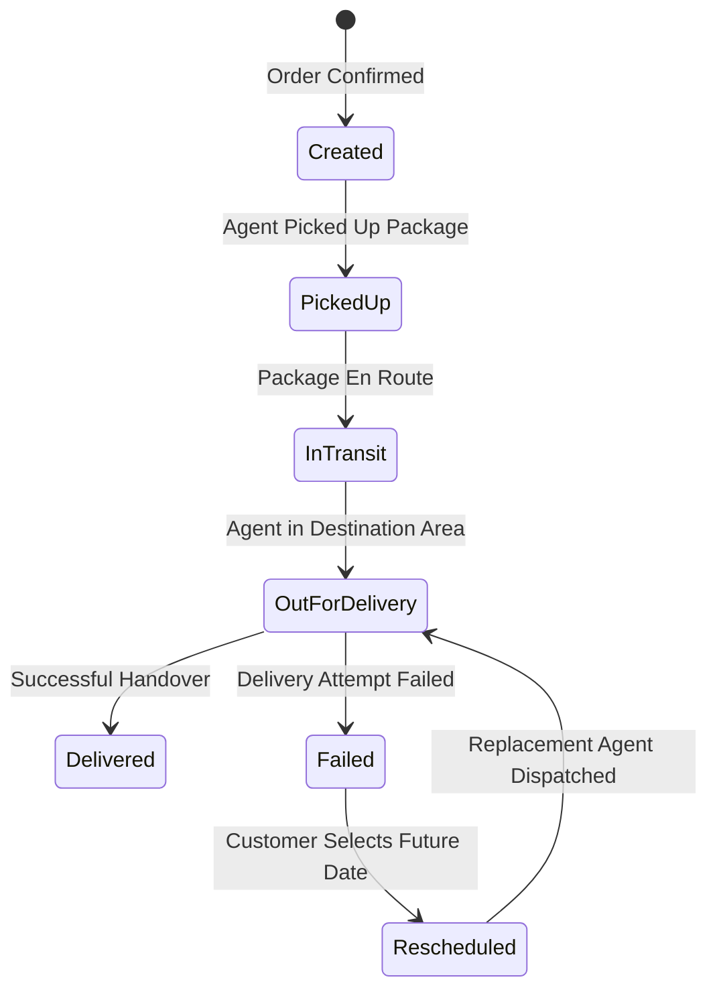

# DeliveryTracker — Last-Mile Logistics & Delivery Management Platform

##  Live Application

- **Frontend:** [https://delivery-tracker-weld.vercel.app/](https://delivery-tracker-weld.vercel.app/)
- **Backend API:** [https://deliverytracker-bhmh.onrender.com](https://deliverytracker-bhmh.onrender.com)
- **Source Code (GitHub):** [https://github.com/VaishnavSreekumar/DeliveryTracker](https://github.com/VaishnavSreekumar/DeliveryTracker)
- **Interactive Swagger Documentation:** [https://deliverytracker-bhmh.onrender.com/swagger](https://deliverytracker-bhmh.onrender.com/swagger)
- **Backend Health Check:** [https://deliverytracker-bhmh.onrender.com/api/health](https://deliverytracker-bhmh.onrender.com/api/health)

---

## 📚 Canonical Documentation Deliverables

| Document | Purpose & Description |
| :--- | :--- |
| **[System Design Document](docs/SYSTEM_DESIGN.md)** | Canonical technical engineering document covering dynamic pricing, dispatching, state machine, and resilience. |
| **[Pricing Engine & Rate Cards Guide](docs/PRICING_GUIDE.md)** | Volumetric weight formula ($\frac{L \times W \times H}{5000}$), B2B/B2C intra/inter matrices, and COD surcharges. |
| **[REST API Reference](docs/API_REFERENCE.md)** | Complete endpoint specifications, payload schemas, query filters, and JWT RBAC authorization policies. |
| **[Database Schema & Data Dictionary](docs/DATABASE_SCHEMA.md)** | Multi-provider architecture (SQLite for local, PostgreSQL for cloud), 9 relational tables, indexes, and immutable audit trail. |
| **[Architecture & Security](docs/ARCHITECTURE.md)** | Decoupled client-server architecture, fault isolation, and threat modeling. |
| **[Assignment Traceability Matrix](docs/ASSIGNMENT_TRACEABILITY.md)** | 100% requirements mapping (REQ-01 through REQ-18) and automated test suite coverage (103/103 passing). |

---

# Overview

DeliveryTracker is a production-grade last-mile delivery management platform engineered to handle the complete delivery lifecycle — from dynamic price estimation and order creation to intelligent agent dispatching, live timeline tracking, failure recovery, customer rescheduling, and final delivery.

The system is built around an ASP.NET Core REST API (.NET 10), Entity Framework Core with dual database support (SQLite locally, PostgreSQL in production), cryptographically signed JWT role-based access control (RBAC), and a high-density React 19 + TypeScript operations interface.

The core engineering focus is implementing real-world logistics business rules:
- Database-driven shipping rate cards (B2C & B2B)
- Volumetric and chargeable weight calculation
- Intra-zone and inter-zone geographic classification
- Cash on Delivery (COD) surcharges
- Intelligent delivery agent auto-assignment (Zone priority + Haversine distance)
- Controlled linear state machine progression
- Append-only immutable delivery tracking history
- Transactional failed delivery recovery & customer rescheduling
- Automatic replacement agent reassignment with previous agent exclusion
- Multi-channel notification engine (In-App, Email over HTTPS / SMTP, Twilio SMS)
- Admin configuration console (Zones, Areas, Rate Cards) and privileged status overrides

---

# Key Features

## 👤 Customer
- **Authentication & Profiles**: Self-registration and login with secure PBKDF2 password hashing, JWT authentication, and dynamic phone number collection.
- **Order Creation**: Create delivery orders with dynamic origin/destination area selection, parcel dimensions, and delivery speed.
- **Live Price Estimation**: Real-time quote preview calculating volumetric weight and dynamic rate card fees before booking.
- **Order Tracking & Privacy**: View personal orders with claim-based privacy scoping (`CustomerId = sub`).
- **Interactive Tracking Timeline**: Visual vertical timeline showing full audit history and status milestones.
- **Self-Service Rescheduling**: Reschedule failed delivery attempts for a future date directly from the customer portal.
- **In-App Notification Center**: Real-time notification tray with live polling and unread indicator badge.

## 🚚 Delivery Agent
- **Agent Portal**: Dedicated agent login scoped to assigned delivery tasks.
- **Active Task List**: View assigned deliveries with pickup/drop addresses, package dimensions, and COD collection requirements.
- **Sequential State Machine**: Advance order status sequentially (`Created` &rarr; `PickedUp` &rarr; `InTransit` &rarr; `OutForDelivery` &rarr; `Delivered`).
- **Failure Handling**: Report failed delivery attempts with mandatory failure reason logging.
- **Reassignment Handling**: Receive and fulfill reassigned deliveries following customer rescheduling.

## 🛡️ Administrator
- **Operations Dashboard**: Monitor all global orders, active agents, zones, and revenue metrics.
- **Multi-Dimensional Filtering**: Filter orders by Status, Zone, Assigned Agent, and search terms.
- **Master Configuration Management**: Dynamic CRUD management for Zones, Areas (with zone reassignment), and Rate Cards.
- **Intelligent Dispatching**: Trigger automated agent assignment or manually assign agents to orders.
- **Privileged Status Overrides**: Force-update order statuses with mandatory administrative reason logging.
- **Communication Audit Trail**: Inspect multi-channel dispatch logs (In-App, Email, SMS) with delivery statuses and provider responses.

---

# System Architecture

DeliveryTracker follows a clean layered architecture with strict separation of concerns:

```text
┌─────────────────────────────────────────────────────────────┐
│                    React 19 + TypeScript SPA                │
│       (Customer Portal • Agent Console • Admin Operations)  │
│                     Hosted on Vercel                        │
└──────────────────────────────┬──────────────────────────────┘
                               │ HTTPS / JSON / Bearer JWT
┌──────────────────────────────▼──────────────────────────────┐
│                  ASP.NET Core 10 Web API                    │
│   Controllers: Auth • Orders • Pricing • Zones • Areas •     │
│                RateCards • Agents • Notifications           │
│                     Hosted on Render                        │
├─────────────────────────────────────────────────────────────┤
│                    Business Services Layer                  │
│   • PricingService          • AgentAssignmentService        │
│   • OrderStatusService      • DeliveryRecoveryService       │
│   • OrderService            • NotificationService           │
├─────────────────────────────────────────────────────────────┤
│                Entity Framework Core 10 ORM                 │
└──────────────┬───────────────────────────────┬──────────────┘
               │                               │
┌──────────────▼─────────────┐   ┌─────────────▼──────────────┐
│    Local: SQLite 3         │   │ Production: PostgreSQL     │
│    (delivery.db)           │   │ (Render Managed PostgreSQL)│
└────────────────────────────┘   └────────────────────────────┘
```

---

# Roles & Access Control

Access control is strictly enforced at the API controller level using JWT Bearer authentication:

| Role | Permitted Capabilities | Scoping Mechanism |
| :--- | :--- | :--- |
| **Customer** | Create orders, calculate quotes, view own orders, reschedule own failed deliveries, receive notifications. | `CustomerId == User.Id` (Claims `sub`) |
| **Agent** | View assigned deliveries, advance order status sequentially, report delivery failures. | `AssignedAgentId == Agent.Id` |
| **Admin** | Global order visibility, manual/auto agent assignment, zone/area/rate card CRUD, status overrides, dispatch audit logs. | `Roles = "Admin"` |

---

# Pricing Engine

The pricing engine dynamically calculates delivery fees from database `RateCards`:

### 1. Volumetric Weight Formula
$$\text{Volumetric Weight (kg)} = \frac{\text{Length (cm)} \times \text{Width (cm)} \times \text{Height (cm)}}{5000}$$

### 2. Chargeable Weight Rule
$$\text{Chargeable Weight} = \max(\text{Actual Weight}, \text{Volumetric Weight})$$

### 3. Rate Resolution Matrix
- **Geographic Scope**: Origin and destination area zones are evaluated dynamically:
  - **Intra-Zone**: Same zone (`pickupArea.ZoneId == dropArea.ZoneId`).
  - **Inter-Zone**: Cross-zone (`pickupArea.ZoneId != dropArea.ZoneId`).
- **Tier Category**: `B2C` (Retail Consumer) vs `B2B` (Commercial Enterprise).
- **Payment Collection**: If `PaymentType == COD`, adds configured flat `CODSurcharge`.

$$\text{Delivery Fee} = \text{Chargeable Weight (kg)} \times \text{Rate Per Kg (₹)}$$
$$\text{Total Amount} = \text{Delivery Fee} + \text{COD Surcharge (if COD)}$$

---

# Intelligent Agent Assignment

Agent assignment evaluates active personnel using a two-tier optimization algorithm:

1. **Availability Filter**: Candidates must have `IsAvailable == true`.
2. **Exclusion Filter**: When rescheduling, previously failed agents (`excludeAgentId`) are excluded.
3. **Same-Zone Priority**: Agents stationed in the order's pickup zone (`agent.ZoneId == pickupArea.ZoneId`) receive top priority.
4. **Haversine Distance Tie-Breaker**: For candidates in equal zone tiers, great-circle distance is calculated:
   $$d = 2R \arcsin\left(\sqrt{\sin^2\left(\frac{\Delta \phi}{2}\right) + \cos(\phi_1)\cos(\phi_2)\sin^2\left(\frac{\Delta \lambda}{2}\right)}\right)$$
5. **Atomic Reservation**: The highest-ranked agent is linked to the order and marked `IsAvailable = false` in a database transaction.

---

# Order Lifecycle & State Machine

Order status transitions are strictly governed by a linear finite state machine in `OrderStatusService`:



- **Immutable Audit Trail**: Every status change appends a row to `OrderStatusHistories` recording `OrderId`, `Status`, `ActorId`, `ActorRole`, `Notes`, and UTC `Timestamp`. Status history is never updated or deleted.

---

# Failed Delivery & Rescheduling Recovery

When an attempt cannot be completed:
1. Agent marks order `Failed` with mandatory failure notes.
2. System records `DeliveryAttempt`, creates a failure notification, and releases the agent (`IsAvailable = true`).
3. Customer opens the order and selects a future delivery date via `POST /api/orders/{id}/reschedule`.
4. System sets status to `Rescheduled`, stores `RescheduledDate`, and automatically finds and assigns a replacement agent (excluding the previous agent).
5. Replacement agent advances `Rescheduled` &rarr; `OutForDelivery` &rarr; `Delivered`.

---

# Multi-Channel Notification Architecture

DeliveryTracker provides a decoupled multi-channel notification engine (`INotificationService`):

| Channel | Architecture & Transport | Sender Configuration | Recipient Resolution |
| :--- | :--- | :--- | :--- |
| **In-App** | Persistent database records (`Notifications` table) | Internal System Event | Customer `sub` ID |
| **Email** | **Production**: Resend HTTPS REST API (Port 443)<br>**Local**: Gmail SMTP (`smtp.gmail.com:587`) | `notifications@deliverytracker.online`<br>(Verified Domain: `deliverytracker.online`) | **Dynamic Customer Email** (`Users.Email`) |
| **SMS** | **Production**: Twilio HTTPS REST API (Port 443) | Configured via `TWILIO_FROM_NUMBER` | **Dynamic Customer Phone** (`Users.PhoneNumber`) |

### Production Email Architecture
- **HTTPS REST Transport**: Cloud container environments (such as Render) frequently restrict outbound SMTP ports (587/465). DeliveryTracker uses the **Resend HTTPS API** over port 443 to eliminate socket timeouts and ensure reliable delivery.
- **Verified Sender Domain**: The production sender is configured as `notifications@deliverytracker.online` under the verified domain `deliverytracker.online`.
- **Dynamic Customer Recipient**: When a customer registers and places an order, the system dynamically retrieves the customer's registered email address from the database and dispatches notifications directly to their actual inbox:
  $$\text{Customer Registers} \longrightarrow \text{Email Stored in DB} \longrightarrow \text{NotificationService Resolves Email} \longrightarrow \text{Resend HTTPS API} \longrightarrow \text{Customer Inbox}$$

### Production SMS Architecture
- **Dynamic Phone Resolution**: Customer phone numbers are collected during registration, stored in `Users.PhoneNumber`, and dynamically resolved when sending SMS alerts for order confirmation, dispatch, failure, and delivery.
- **Twilio HTTPS REST API**: SMS dispatches are transmitted securely via Twilio's REST API. On Twilio trial accounts, destination numbers must be added to the verified numbers list in the Twilio console.

### Honest Delivery Semantics & Fault Isolation
- **Honest Status Recording**: The application logs the real provider response for every dispatch. When a provider accepts the message, status is marked **`Sent`**; if rejected (e.g. rate limit, invalid number, or provider policy), status is recorded as **`Failed`** along with the provider's exact error message. The system never fakes a successful delivery status.
- **Fault Isolation**: External provider calls are encapsulated in strict `try-catch` isolation boundaries so that third-party network outages never cause core database order transactions to fail.

---

# Technology Stack

- **Backend Framework**: ASP.NET Core 10 Web API (C# / .NET 10)
- **Database & ORM**: Entity Framework Core 10 (`Npgsql.EntityFrameworkCore.PostgreSQL` / `Microsoft.EntityFrameworkCore.Sqlite`)
- **Security**: JWT Bearer Tokens, PBKDF2 with HMAC-SHA256 password hashing
- **Testing**: xUnit, FluentAssertions, Mocked HttpMessageHandler (103 automated tests)
- **Frontend SPA**: React 19, TypeScript, Vite, Lucide Icons, Vanilla CSS design tokens
- **Cloud Infrastructure**: Vercel (Frontend SPA), Render (Docker Web Service), Render PostgreSQL

---

# Project Structure

```text
DeliveryTracker/
├── DeliveryTracker.API/            # ASP.NET Core Web API (.NET 10)
│   ├── Controllers/               # Auth, Orders, Pricing, Notifications, Zones, Areas, RateCards, Agents
│   ├── Data/                      # AppDbContext, DbInitializer, EF Migrations
│   ├── DTOs/                      # Request & Response Data Contracts
│   ├── Entities/                  # User, Agent, Zone, Area, RateCard, Order, Notification, etc.
│   ├── Services/                  # Pricing, Assignment, OrderStatus, Recovery, Notifications
│   │   └── Communication/         # ResendEmailProvider, SmtpEmailProvider, TwilioSmsProvider
│   ├── appsettings.json           # Base Configuration
│   ├── Dockerfile                 # Multi-stage production container
│   └── Program.cs                 # Dynamic DI & Middleware Setup
├── DeliveryTracker.Tests/          # xUnit Test Suite (103 Tests)
│   ├── PricingServiceTests.cs
│   ├── AgentAssignmentServiceTests.cs
│   ├── OrderStatusServiceTests.cs
│   ├── DeliveryRecoveryServiceTests.cs
│   ├── ResendEmailProviderTests.cs
│   ├── CustomerPhoneNumberTests.cs
│   └── AdminOrderOperationsTests.cs
├── DeliveryTracker.Web/            # React 19 + TypeScript SPA
│   ├── src/
│   │   ├── api/                   # Centralized API Client (Axios/Fetch wrapper)
│   │   ├── components/            # Timeline, StatusBadge, NotificationCenter, Modals
│   │   ├── context/               # AuthContext
│   │   └── pages/                 # Booking, Detail, Operations Console, Admin Config, Auth
│   ├── vercel.json                # SPA deep-linking rewrite rules
│   └── package.json
├── docs/                          # Canonical Technical Documentation
│   ├── SYSTEM_DESIGN.md           # Canonical system design document
│   ├── PRICING_GUIDE.md           # Volumetric pricing & rate cards guide
│   ├── API_REFERENCE.md           # REST endpoint specifications
│   ├── DATABASE_SCHEMA.md         # Data dictionary & ER diagrams
│   ├── ARCHITECTURE.md            # Architecture & security document
│   └── ASSIGNMENT_TRACEABILITY.md # 100% requirements verification matrix
├── vercel.json                    # Root monorepo Vercel deployment configuration
└── README.md                      # Primary documentation deliverable
```

---

# Local Setup

### Prerequisites
- [.NET 10 SDK](https://dotnet.microsoft.com/download)
- [Node.js (v18+) & npm](https://nodejs.org/)

### 1. Run Backend API
```bash
cd DeliveryTracker.API
dotnet run --urls "http://localhost:5055"
```
The API server automatically applies EF migrations, seeds initial data, and starts at `http://localhost:5055`. Explore interactive Swagger at `http://localhost:5055/swagger`.

### 2. Run Frontend Client
```bash
cd DeliveryTracker.Web
npm install
npm run dev
```
Open your browser at `http://localhost:5173`.

---

# Demo Accounts

The database is initialized with pre-configured demo credentials:

| Role | Email | Password | Phone Number |
| :--- | :--- | :--- | :--- |
| **System Admin** | `admin@delivery.com` | `Admin@123` | `+18005550100` |
| **Customer** | `customer@delivery.com` | `Customer@123` | `+919037350803` |
| **Delivery Agent 1** | `agent1@delivery.com` | `Agent@123` | `+18005550101` |
| **Delivery Agent 2** | `agent2@delivery.com` | `Agent@123` | `+18005550102` |

---

# Environment Variables & Security

### Security Best Practices
- **Local Overrides**: `.env.local` is used exclusively for local environment secrets and is strictly **Git-ignored**.
- **Production Secrets**: All production secrets are configured securely in the **Render Dashboard Environment Variables** and never committed to source control.
- **Frontend Isolation**: The React frontend client never receives or exposes backend provider credentials (all database, Resend, and Twilio calls execute exclusively server-side).

### Environment Variable Reference

```ini
# --- Database Configuration ---
# Production: PostgreSQL connection string
# Local fallback: SQLite (delivery.db)
ConnectionStrings__DefaultConnection=postgresql://<user>:<password>@<host>:<port>/<database>

# --- JWT Authentication ---
Jwt__SecretKey=<minimum 32 character secure secret key>
Jwt__Issuer=DeliveryTrackerAPI
Jwt__Audience=DeliveryTrackerClients

# --- CORS Configuration ---
ALLOWED_ORIGINS=https://delivery-tracker-weld.vercel.app,http://localhost:5173

# --- Email: Production (Resend HTTPS REST API) ---
EMAIL_PROVIDER=HTTP
RESEND_API_KEY=<your Resend API key>
HTTP_EMAIL_API_URL=https://api.resend.com/emails
HTTP_EMAIL_FROM=notifications@deliverytracker.online
HTTP_EMAIL_FROM_NAME=DeliveryTracker Dispatch

# --- Email: Local Development (SMTP Fallback) ---
# EMAIL_PROVIDER=SMTP
# SMTP_HOST=smtp.gmail.com
# SMTP_PORT=587
# SMTP_USERNAME=<operator Gmail>
# SMTP_PASSWORD=<Gmail App Password>
# SMTP_FROM=<operator Gmail>
# SMTP_FROM_NAME=DeliveryTracker Dispatch

# --- SMS: Twilio HTTPS REST API ---
SMS_ENABLED=true
TWILIO_ACCOUNT_SID=<your Twilio Account SID>
TWILIO_API_KEY=<your Twilio API Key>
TWILIO_API_SECRET=<your Twilio API Secret>
TWILIO_FROM_NUMBER=<your Twilio Sender Phone Number>

# --- Frontend Client ---
VITE_API_BASE_URL=https://deliverytracker-bhmh.onrender.com/api
```

---

# Testing & Verification

### Automated Unit Test Suite (103 Tests)
```bash
dotnet test
```
**Results:** `Passed! - Failed: 0, Passed: 103, Skipped: 0 (100% Pass Rate)`

### Production Bundle Build
```bash
cd DeliveryTracker.Web
npm run build
```
**Results:** TypeScript checked and built cleanly.

---

# Submission

| Resource | URL | Description |
| :--- | :--- | :--- |
| **GitHub Repository** | [https://github.com/VaishnavSreekumar/DeliveryTracker](https://github.com/VaishnavSreekumar/DeliveryTracker) | Source code repository (Primary Submission) |
| **Live Application (Frontend)** | [https://delivery-tracker-weld.vercel.app/](https://delivery-tracker-weld.vercel.app/) | Hosted React 19 SPA client on Vercel |
| **Backend Web API** | [https://deliverytracker-bhmh.onrender.com](https://deliverytracker-bhmh.onrender.com) | Hosted ASP.NET Core 10 API on Render |
| **Interactive Swagger API Docs** | [https://deliverytracker-bhmh.onrender.com/swagger](https://deliverytracker-bhmh.onrender.com/swagger) | Live OpenAPI documentation & explorer |
| **Service Health Check** | [https://deliverytracker-bhmh.onrender.com/api/health](https://deliverytracker-bhmh.onrender.com/api/health) | Real-time backend health monitor endpoint |
