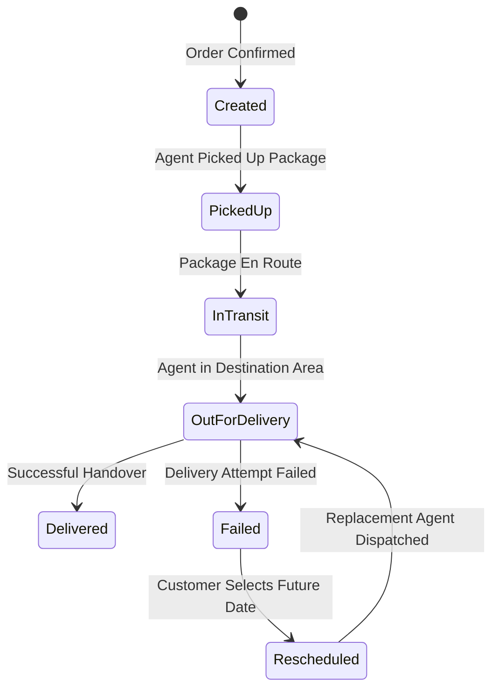

# DeliveryTracker

##  Live Application

- **Frontend (Web Application)**: [https://delivery-tracker-weld.vercel.app/](https://delivery-tracker-weld.vercel.app/)
- **Backend API Server**: [https://deliverytracker-bhmh.onrender.com](https://deliverytracker-bhmh.onrender.com)
- **Interactive Swagger Documentation**: [https://deliverytracker-bhmh.onrender.com/swagger](https://deliverytracker-bhmh.onrender.com/swagger)
- **Backend Health Check**: [https://deliverytracker-bhmh.onrender.com/api/health](https://deliverytracker-bhmh.onrender.com/api/health)
- **GitHub Repository**: [https://github.com/VaishnavSreekumar/DeliveryTracker](https://github.com/VaishnavSreekumar/DeliveryTracker)

---

## Canonical Documentation Deliverables

| Document | Purpose & Description |
| :--- | :--- |
| **[System Design Document](docs/SYSTEM_DESIGN.md)** | **597 words** (strictly $\le 800$ words) technical engineering document covering dynamic pricing, dispatching, state machine, and resilience. |
| **[Pricing Engine & Rate Cards Guide](docs/PRICING_GUIDE.md)** | Volumetric weight formula ($\frac{L \times W \times H}{5000}$), B2B/B2C intra/inter matrices, and COD surcharges. |
| **[REST API Reference](docs/API_REFERENCE.md)** | Complete endpoint specifications, payload schemas, query filters, and JWT RBAC authorization policies. |
| **[Database Schema & Data Dictionary](docs/DATABASE_SCHEMA.md)** | Multi-provider architecture (SQLite for local, PostgreSQL for cloud), 9 tables, indexes, and immutable audit trail. |
| **[Architecture & Security](docs/ARCHITECTURE.md)** | Decoupled client-server architecture, fault isolation, and threat modeling. |
| **[Assignment Traceability Matrix](docs/ASSIGNMENT_TRACEABILITY.md)** | 100% requirements mapping (REQ-01 through REQ-18) and automated test suite coverage (103/103 passing). |

---

# Overview

DeliveryTracker is a production-grade last-mile delivery management platform engineered to handle the complete delivery lifecycle — from dynamic price estimation and order creation to intelligent agent dispatching, live timeline tracking, failure recovery, rescheduling, and final delivery.

The system is built around an ASP.NET Core REST API (.NET 10), Entity Framework Core with dual database support (SQLite locally, PostgreSQL in production), cryptographically signed JWT role authorization, and a high-density React 19 + TypeScript operations interface.

The core engineering focus is implementing real-world logistics business rules:
- Database-driven shipping rate cards (B2C & B2B)
- Volumetric and chargeable weight calculation
- Intra-zone and inter-zone geographic classification
- Cash on Delivery (COD) surcharges
- Intelligent delivery agent auto-assignment (Zone priority + Haversine distance)
- Controlled linear state machine progression
- Append-only immutable delivery tracking history
- Transactional failed delivery recovery & customer rescheduling
- Automatic replacement agent reassignment with previous agent exclusion
- Multi-channel notification engine (In-App, Email over HTTPS / SMTP, Twilio SMS)
- Admin configuration console (Zones, Areas, Rate Cards) and privileged status overrides

---

# Key Features

## Customer
- Self-registration and login with secure PBKDF2 password hashing and JWT authentication.
- Create delivery orders with dynamic origin/destination area selection.
- Real-time quote preview calculating volumetric weight and rate card fees before booking.
- View personal orders with claim-based privacy scoping (`CustomerId = sub`).
- Interactive order detail view with signature vertical tracking audit trail.
- Self-service rescheduling of failed deliveries for future dates.
- Real-time In-App Notification Center with live polling and unread badge.

## Delivery Agent
- Dedicated agent login scoped to assigned delivery tasks.
- View assigned deliveries with pickup/drop addresses, package dimensions, and cash collection requirements.
- Sequential state machine progression (`Created` &rarr; `PickedUp` &rarr; `InTransit` &rarr; `OutForDelivery` &rarr; `Delivered`).
- Report failed delivery attempts with mandatory reason logging.
- Handle reassigned deliveries after customer rescheduling.

## Administrator
- Global operations dashboard monitoring all orders, agents, zones, and revenue.
- Multi-dimensional filtering (Status, Zone, Agent, Search query).
- Dynamic configuration management for Zones, Areas (with zone reassignment), and Rate Cards.
- Trigger intelligent agent auto-assignment or manual agent dispatching.
- Privileged status override capability with mandatory audit reason logging.
- Complete multi-channel communication audit log inspection for every order.

---

# System Architecture

DeliveryTracker follows a clean layered architecture with strict separation of concerns:

```text
┌─────────────────────────────────────────────────────────────┐
│                    React 19 + TypeScript SPA                │
│       (Customer Portal • Agent Console • Admin Operations)  │
└──────────────────────────────┬──────────────────────────────┘
                               │ HTTPS / JSON / Bearer JWT
┌──────────────────────────────▼──────────────────────────────┐
│                  ASP.NET Core 10 Web API                    │
│   Controllers: Auth • Orders • Pricing • Zones • Areas •     │
│                RateCards • Agents • Notifications           │
├─────────────────────────────────────────────────────────────┤
│                    Business Services Layer                  │
│   • PricingService          • AgentAssignmentService        │
│   • OrderStatusService      • DeliveryRecoveryService       │
│   • OrderService            • NotificationService           │
├─────────────────────────────────────────────────────────────┤
│                Entity Framework Core 10 ORM                 │
└──────────────┬───────────────────────────────┬──────────────┘
               │                               │
┌──────────────▼─────────────┐   ┌─────────────▼──────────────┐
│    Local: SQLite 3         │   │ Production: PostgreSQL     │
│    (delivery.db)           │   │ (Render Managed PG)        │
└────────────────────────────┘   └────────────────────────────┘
```

---

# Roles & Access Control

Access control is strictly enforced at the API controller level using JWT Bearer authentication:

| Role | Permitted Capabilities | Scoping Mechanism |
| :--- | :--- | :--- |
| **Customer** | Create orders, calculate quotes, view own orders, reschedule own failed deliveries, receive notifications. | `CustomerId == User.Id` (Claims `sub`) |
| **Agent** | View assigned deliveries, advance order status sequentially, report delivery failures. | `AssignedAgentId == Agent.Id` |
| **Admin** | Global order visibility, manual/auto agent assignment, zone/area/rate card CRUD, status overrides, dispatch audit logs. | `Roles = "Admin"` |

---

# Pricing Engine

The pricing engine dynamically calculates delivery fees from database `RateCards`:

### 1. Volumetric Weight Formula
$$\text{Volumetric Weight (kg)} = \frac{\text{Length (cm)} \times \text{Width (cm)} \times \text{Height (cm)}}{5000}$$

### 2. Chargeable Weight Rule
$$\text{Chargeable Weight} = \max(\text{Actual Weight}, \text{Volumetric Weight})$$

### 3. Rate Resolution Matrix
- **Geographic Scope**: Origin and destination area zones are compared:
  - **Intra-Zone**: Same zone (`pickupArea.ZoneId == dropArea.ZoneId`).
  - **Inter-Zone**: Cross-zone (`pickupArea.ZoneId != dropArea.ZoneId`).
- **Tier Category**: `B2C` (Retail Consumer) vs `B2B` (Commercial Enterprise).
- **Payment Collection**: If `PaymentType == COD`, adds configured flat `CODSurcharge`.

$$\text{Delivery Fee} = \text{Chargeable Weight (kg)} \times \text{Rate Per Kg (₹)}$$
$$\text{Total Amount} = \text{Delivery Fee} + \text{COD Surcharge (if COD)}$$

---

# Intelligent Agent Assignment

Agent assignment evaluates active personnel using a two-tier optimization algorithm:

1. **Availability Filter**: Candidates must have `IsAvailable == true`.
2. **Exclusion Filter**: When rescheduling, previously failed agents (`excludeAgentId`) are excluded.
3. **Same-Zone Priority**: Agents stationed in the order's pickup zone (`agent.ZoneId == pickupArea.ZoneId`) receive top priority.
4. **Haversine Distance Tie-Breaker**: For candidates in equal zone tiers, great-circle distance is calculated:
   $$d = 2R \arcsin\left(\sqrt{\sin^2\left(\frac{\Delta \phi}{2}\right) + \cos(\phi_1)\cos(\phi_2)\sin^2\left(\frac{\Delta \lambda}{2}\right)}\right)$$
5. **Atomic Reservation**: The highest-ranked agent is linked to the order and marked `IsAvailable = false` in a database transaction.

---

# Order Lifecycle & State Machine

Order status transitions are strictly governed by a linear finite state machine in `OrderStatusService`:



- **Immutable Audit Trail**: Every status change appends a row to `OrderStatusHistories` recording `OrderId`, `Status`, `ActorId`, `ActorRole`, `Notes`, and UTC `Timestamp`. Status history is never updated or deleted.

---

# Failed Delivery & Rescheduling Recovery

When an attempt cannot be completed:
1. Agent marks order `Failed` with mandatory failure notes.
2. System records `DeliveryAttempt`, creates a failure notification, and releases the agent (`IsAvailable = true`).
3. Customer opens the order and selects a future delivery date via `POST /api/orders/{id}/reschedule`.
4. System sets status to `Rescheduled`, stores `RescheduledDate`, and automatically finds and assigns a replacement agent (excluding the previous agent).
5. Replacement agent advances `Rescheduled` &rarr; `OutForDelivery` &rarr; `Delivered`.

---

# Multi-Channel Notifications

DeliveryTracker features a decoupled notification subsystem (`INotificationService`):

| Channel | Local Development | Production (Cloud) | Trigger Events |
| :--- | :--- | :--- | :--- |
| **In-App** | PostgreSQL / SQLite | PostgreSQL / SQLite | All lifecycle events |
| **Email** | Gmail SMTP (`smtp.gmail.com:587`) | **Resend HTTPS REST API** (Port 443) | Order created, failed, rescheduled, delivered |
| **SMS** | Twilio REST API / Sandbox | **Twilio REST API** (Port 443) | Order created, out for delivery, failed, rescheduled, delivered |

- **Dynamic Recipient Resolution**: Recipient emails and phone numbers are dynamically obtained from `Users.Email` and `Users.PhoneNumber`.
- **Honest Delivery Semantics**: The database accurately records `Sent` on provider acceptance and `Failed` with the exact provider error message on rejection. Faking delivery is strictly prohibited.
- **Fault Isolation**: Email or SMS network issues never crash or roll back core delivery state transactions.

---

# Technology Stack

- **Backend**: C# / .NET 10, ASP.NET Core Web API
- **ORM & Data Access**: Entity Framework Core 10 (`Npgsql.EntityFrameworkCore.PostgreSQL` / `Microsoft.EntityFrameworkCore.Sqlite`)
- **Security**: JWT Bearer Tokens, PBKDF2 with HMAC-SHA256 password hashing
- **Testing**: xUnit, FluentAssertions, Mocked HttpMessageHandler (103 automated tests)
- **Frontend**: React 19, TypeScript, Vite, Lucide Icons, Vanilla CSS design tokens
- **Cloud Infrastructure**: Vercel (Frontend SPA), Render (Dockerized Web Service), Render Free PostgreSQL

---

# Project Structure

```text
DeliveryTracker/
├── DeliveryTracker.API/            # ASP.NET Core Web API (.NET 10)
│   ├── Controllers/               # Auth, Orders, Pricing, Notifications, Zones, Areas, RateCards, Agents
│   ├── Data/                      # AppDbContext, DbInitializer, EF Migrations
│   ├── DTOs/                      # Request & Response Data Contracts
│   ├── Entities/                  # User, Agent, Zone, Area, RateCard, Order, Notification, etc.
│   ├── Services/                  # Pricing, Assignment, OrderStatus, Recovery, Notifications
│   │   └── Communication/         # ResendEmailProvider, SmtpEmailProvider, TwilioSmsProvider
│   ├── appsettings.json           # Base Configuration
│   ├── Dockerfile                 # Multi-stage production container
│   └── Program.cs                 # Dynamic DI & Middleware Setup
├── DeliveryTracker.Tests/          # xUnit Test Suite (103 Tests)
│   ├── PricingServiceTests.cs
│   ├── AgentAssignmentServiceTests.cs
│   ├── OrderStatusServiceTests.cs
│   ├── DeliveryRecoveryServiceTests.cs
│   ├── ResendEmailProviderTests.cs
│   ├── CustomerPhoneNumberTests.cs
│   └── AdminOrderOperationsTests.cs
├── DeliveryTracker.Web/            # React 19 + TypeScript SPA
│   ├── src/
│   │   ├── api/                   # Centralized API Client (Axios/Fetch wrapper)
│   │   ├── components/            # Timeline, StatusBadge, NotificationCenter, Modals
│   │   ├── context/               # AuthContext
│   │   └── pages/                 # Booking, Detail, Operations Console, Admin Config, Auth
│   ├── vercel.json                # SPA deep-linking rewrite rules
│   └── package.json
├── docs/                          # Comprehensive Technical Documentation
│   ├── SYSTEM_DESIGN.md           # 597-word canonical system design document
│   ├── PRICING_GUIDE.md           # Volumetric pricing & rate cards guide
│   ├── API_REFERENCE.md           # 22 REST endpoint specifications
│   ├── DATABASE_SCHEMA.md         # Data dictionary & ER diagrams
│   └── ASSIGNMENT_TRACEABILITY.md # 100% requirements verification matrix
├── vercel.json                    # Root monorepo Vercel deployment configuration
└── README.md                      # Primary documentation deliverable
```

---

# Local Setup

### Prerequisites
- [.NET 10 SDK](https://dotnet.microsoft.com/download)
- [Node.js (v18+) & npm](https://nodejs.org/)

### 1. Run Backend API
```bash
cd DeliveryTracker.API
dotnet run --urls "http://localhost:5055"
```
The API server automatically applies EF migrations, seeds master data, and starts at `http://localhost:5055`. Explore interactive Swagger at `http://localhost:5055/swagger`.

### 2. Run Frontend Client
```bash
cd DeliveryTracker.Web
npm install
npm run dev
```
Open your browser at `http://localhost:5173`.

---

# Demo Accounts

The database is initialized with pre-configured demo credentials:

| Role | Email | Password | Phone Number |
| :--- | :--- | :--- | :--- |
| **System Admin** | `admin@delivery.com` | `Admin@123` | `+18005550100` |
| **Customer** | `customer@delivery.com` | `Customer@123` | `+919037350803` |
| **Delivery Agent 1** | `agent1@delivery.com` | `Agent@123` | `+18005550101` |
| **Delivery Agent 2** | `agent2@delivery.com` | `Agent@123` | `+18005550102` |

---

# Environment Variables Reference

Sensitive credentials must be configured as server-side environment variables and **never committed to version control**:

| Variable Name | Purpose & Example Placeholder | Scope |
| :--- | :--- | :--- |
| `ConnectionStrings__DefaultConnection` | Database connection string (SQLite or PostgreSQL) | Backend |
| `Jwt__SecretKey` | JWT cryptographic signing key (min 32 chars) | Backend |
| `ALLOWED_ORIGINS` | Comma-separated CORS allowed origins | Backend |
| `EMAIL_PROVIDER` | `HTTP` (Production Resend) or `SMTP` (Local Gmail) | Backend |
| `RESEND_API_KEY` | Resend HTTPS API key (`re_...`) | Backend |
| `HTTP_EMAIL_FROM` | Verified sender email (`onboarding@resend.dev`) | Backend |
| `HTTP_EMAIL_FROM_NAME` | Display sender name (`DeliveryTracker Dispatch`) | Backend |
| `SMTP_HOST` / `SMTP_PORT` | SMTP host (`smtp.gmail.com`) and port (`587`) | Backend (Local) |
| `SMTP_USERNAME` / `SMTP_PASSWORD` | SMTP operator credentials | Backend (Local) |
| `TWILIO_ACCOUNT_SID` | Twilio Account SID (`AC...`) | Backend |
| `TWILIO_API_KEY` / `TWILIO_API_SECRET` | Twilio API Key and Secret | Backend |
| `TWILIO_FROM_NUMBER` | Registered Twilio sender phone number | Backend |
| `VITE_API_BASE_URL` | Frontend API target (`https://deliverytracker-bhmh.onrender.com/api`) | Frontend |

---

# Testing & Verification

### Automated Unit Test Suite (103 Tests)
```bash
dotnet test
```
**Results:** `Passed! - Failed: 0, Passed: 103, Skipped: 0 (100% Pass Rate)`

### Production Bundle Build
```bash
cd DeliveryTracker.Web
npm run build
```
**Results:** TypeScript checked and built cleanly (`dist/assets/index-B7O1ciIu.js`).

---

# Production Deployment

DeliveryTracker is configured for zero-cost public hosting:
- **Frontend SPA (Vercel)**: Deployed with root monorepo `vercel.json` routing rules to [https://delivery-tracker-weld.vercel.app/](https://delivery-tracker-weld.vercel.app/).
- **Backend Web Service (Render)**: Containerized Docker service deployed to [https://deliverytracker-bhmh.onrender.com](https://deliverytracker-bhmh.onrender.com).
- **Persistence (Render PostgreSQL)**: Automated EF Core schema creation and master data seeding.
- **Email Delivery (Resend)**: HTTPS REST API email delivery over Port 443.
- **SMS Delivery (Twilio)**: Real-time SMS notifications to verified customer phone numbers.

---

# Submission Notes

- **Repository Main Branch**: [`https://github.com/VaishnavSreekumar/DeliveryTracker`](https://github.com/VaishnavSreekumar/DeliveryTracker)
- **Live System Verification**: All core features (Authentication, Quote Calculation, Order Creation, Agent Auto-Assignment, State Transitions, Failure Recovery, Rescheduling, Notifications, and Admin Management) are verified live on both local and hosted environments.
- **Clean Repository**: 0 secrets, passwords, or raw tokens exist in tracked repository files.
