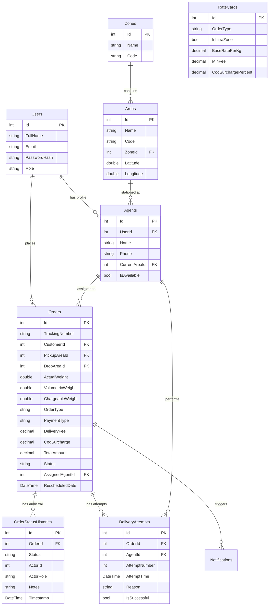

# System Architecture & Technical Specifications

## Overview
DeliveryTracker is designed as a modular, decoupled, single-solution logistics management system comprising an ASP.NET Core REST API, EF Core ORM layer, SQLite relational database, xUnit test suite, and a React TypeScript SPA.

---

## 1. Domain Entities & Database Schema

---

## 2. Component Design & Layer Interaction

### Controller Layer (`DeliveryTracker.API/Controllers`)
Exposes HTTP REST endpoints. Intercepts JWT Bearer tokens, extracts identity claims (`ClaimTypes.NameIdentifier`, `ClaimTypes.Role`), validates request DTOs, and delegates business logic to specialized services.

### Service Layer (`DeliveryTracker.API/Services`)
Encapsulates domain business logic:
- `IPricingService`: Evaluates volumetric formula $\frac{L \times W \times H}{5000}$, queries `RateCards`, applies COD surcharges.
- `IAgentAssignmentService`: Filters available agents, computes Haversine distances, skips excluded agents, mutates availability states.
- `IOrderStatusService`: Enforces state transitions (`Created` &rarr; `PickedUp` &rarr; `InTransit` &rarr; `OutForDelivery` &rarr; `Delivered` / `Failed`), logs `OrderStatusHistory` audit records.
- `IDeliveryRecoveryService`: Manages failure recording, customer notification generation, transactional agent release, and automatic agent reassignment.
- `IAuthService`: Handles password verification via `PasswordHasher<User>`, JWT signing with HMAC-SHA256, and registration.

### Data Layer (`DeliveryTracker.API/Data`)
EF Core `DeliveryDbContext` configured with SQLite. Seeding handled via `DbInitializer.cs` during application startup via `db.Database.Migrate()`.

---

## 3. Security Architecture

- **Token Protocol**: OAuth2 / JWT Bearer Authentication.
- **Claims**:
  - `sub`: User ID (`int`)
  - `email`: Email address
  - `role`: Role string (`Customer`, `Agent`, `Admin`)
- **Key Storage**: `Jwt:SecretKey` stored in `appsettings.json` (configurable via environment variables).
- **Data Scoping**: Customers can only view/reschedule orders where `Order.CustomerId == authenticatedUserId`. Agents can only update status on orders where `Order.AssignedAgentId == authenticatedAgentId`.

---

## 4. Test Strategy

1. **Automated Unit Tests**: 55 xUnit unit tests in `DeliveryTracker.Tests` running against isolated in-memory SQLite instances.
2. **Integration & E2E Verification**: Python test script `scratch/test_phase8_e2e_flow.py` verifying full end-to-end multi-user workflow on live ASP.NET Core server.
3. **Frontend Production Build**: Vite build compilation producing static distribution assets (`dist/`).
