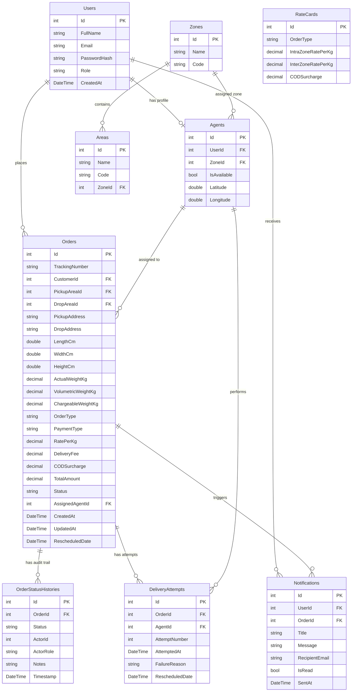

# System Architecture & Technical Specifications

## Overview
DeliveryTracker is designed as a modular, decoupled, single-solution logistics management platform comprising an ASP.NET Core REST API, EF Core ORM layer, SQLite relational database, xUnit test suite, and a React TypeScript SPA.

---

## 1. Domain Entities & Database Schema



---

## 2. Component Design & Layer Interaction

### Frontend Application (`DeliveryTracker.Web`)
React 19 + TypeScript SPA built with Vite:
- **`AuthContext`**: Manages JWT token lifecycle, active user profile, and automatic Bearer authorization headers.
- **`Layout`**: Application shell containing responsive navigation, user identity status, and the `NotificationCenter` dropdown.
- **`NotificationCenter`**: Live polling bell widget displaying unread counts, status, timestamps, and 1-click navigation to affected deliveries.
- **`CustomerCreateOrderPage`**: 4-step wizard with dynamic volumetric pricing calculation and instantaneous price breakdown cards.
- **`OrdersListPage`**: Real-time filtered operational grid with text search, status dropdowns, and role-appropriate actions.
- **`OrderDetailPage`**: Route breakdown, volumetric metrics, and signature vertical audit timeline.
- **`AdminOperationsPage`**: Operations dashboard with fleet status KPIs, unassigned queue, and 1-click intelligent auto-assignment.

### Controller Layer (`DeliveryTracker.API/Controllers`)
Exposes HTTP REST endpoints, intercepts JWT Bearer tokens, extracts identity claims (`sub`, `role`, `email`), and validates input DTOs:
- `AuthController`: User registration (`POST /api/auth/register`) and credential authentication (`POST /api/auth/login`).
- `PricingController`: Public/customer rate calculation (`POST /api/orders/calculate-price`).
- `OrdersController`: Order placement, scoped listing, privacy-checked order detail, status progression, customer rescheduling, and admin auto-assignment.
- `NotificationsController`: Protected endpoints (`GET /api/notifications`, `PATCH /api/notifications/{id}/read`) strictly scoped by user ownership.
- `ZonesController`: Master data retrieval for zones and serviced areas.

### Service Layer (`DeliveryTracker.API/Services`)
Encapsulates all domain business logic:
- `IPricingService`: Evaluates volumetric formula $\frac{L \times W \times H}{5000}$, determines IntraZone vs. InterZone routing, queries `RateCards`, and applies flat COD surcharges.
- `IAgentAssignmentService`: Filters available agents (`IsAvailable == true`), prioritizes same-zone agents, resolves tie-breaks via Great-Circle Haversine distance from pickup coordinates, excludes specified agents (during recovery), and mutates agent availability flags.
- `IOrderStatusService`: Enforces deterministic state transitions (`Created` &rarr; `PickedUp` &rarr; `InTransit` &rarr; `OutForDelivery` &rarr; `Delivered` / `Failed`), logs immutable append-only `OrderStatusHistory` records, and records `DeliveryAttempt` and customer failure notifications on failed attempts.
- `IDeliveryRecoveryService`: Handles failure recovery within an atomic execution transaction: releases previous agent (`IsAvailable = true`), persists `Order.RescheduledDate`, excludes previous agent from reassignment, triggers assignment of an available replacement agent, records `Rescheduled` history, and generates customer confirmation notifications.
- `IAuthService`: Handles password hashing via ASP.NET Core `PasswordHasher<User>`, JWT signing via HMAC-SHA256, and registration.

### Data Layer (`DeliveryTracker.API/Data`)
EF Core `AppDbContext` configured with SQLite. Automatic migration application and seed data population handled via `DbInitializer.cs` during application startup.

---

## 3. Core Business Algorithms & Rules

### Pricing Calculation
$$\text{Volumetric Weight (kg)} = \frac{\text{Length (cm)} \times \text{Width (cm)} \times \text{Height (cm)}}{5000}$$
$$\text{Chargeable Weight (kg)} = \max(\text{Actual Weight}, \text{Volumetric Weight})$$
$$\text{Delivery Fee} = \text{Chargeable Weight} \times \text{Rate Per Kg}$$
$$\text{Total Amount} = \text{Delivery Fee} + \text{COD Surcharge (if COD)}$$

### Agent Assignment Strategy
1. **Availability Filter**: Agent must have `IsAvailable == true`.
2. **Exclusion Filter**: Excludes `excludeAgentId` (e.g. agent who previously failed delivery on this order).
3. **Same-Zone Priority**: Agents stationed in the same zone as the pickup area are given primary preference.
4. **Haversine Distance**: Tie-breaker computed between Agent coordinates and Pickup Zone centroid using the Great-Circle distance formula:
   $$d = 2R \cdot \arcsin\left(\sqrt{\sin^2\left(\frac{\Delta\phi}{2}\right) + \cos(\phi_1)\cos(\phi_2)\sin^2\left(\frac{\Delta\lambda}{2}\right)}\right)$$
5. **State Mutation**: Selected agent is marked `IsAvailable = false` atomically.

### State Machine Transition Rules
| Current Status | Allowed Next Status | Actor Role | Notes |
| :--- | :--- | :--- | :--- |
| `Created` | `PickedUp` | Agent, Admin | Order package received |
| `PickedUp` | `InTransit` | Agent, Admin | Package in transit between hubs |
| `InTransit` | `OutForDelivery` | Agent, Admin | Agent out for final delivery |
| `OutForDelivery` | `Delivered` | Agent, Admin | Successful delivery |
| `OutForDelivery` | `Failed` | Agent, Admin | Delivery attempt failed; requires reason notes |
| `Failed` | `Rescheduled` | Customer | Customer selects future date; triggers recovery |
| `Rescheduled` | `OutForDelivery` | Reassigned Agent, Admin | Reassigned agent attempts redelivery |

---

## 4. Security Architecture

- **Protocol**: OAuth2 / JWT Bearer Authentication (HMAC-SHA256).
- **Claims**:
  - `sub` (`ClaimTypes.NameIdentifier`): Integer User ID.
  - `email` (`ClaimTypes.Email`): User email address.
  - `role` (`ClaimTypes.Role`): User role (`Customer`, `Agent`, `Admin`).
- **Data Scoping**:
  - Customers can only view and reschedule orders where `Order.CustomerId == authenticatedUserId`.
  - Agents can only view and update status on orders where `Order.AssignedAgentId == authenticatedAgentId`.
  - Notifications are strictly filtered where `Notification.UserId == authenticatedUserId`. Non-owners receive `HTTP 403 Forbidden` if attempting to mark another user's notifications as read.
  - Admins retain operational visibility across all system orders, fleet agents, and notifications.

---

## 5. Multi-Channel Communication Architecture

```text
                                  ┌────────────────────────┐
                                  │   Lifecycle Trigger    │
                                  │ (Order / Status Event) │
                                  └───────────┬────────────┘
                                              │
                                              ▼
                                 ┌─────────────────────────┐
                                 │   INotificationService  │
                                 └────────────┬────────────┘
                                              │
                    ┌─────────────────────────┼─────────────────────────┐
                    ▼                         ▼                         ▼
          ┌───────────────────┐     ┌───────────────────┐     ┌───────────────────┐
          │  In-App Channel   │     │   Email Channel   │     │    SMS Channel    │
          └─────────┬─────────┘     └─────────┬─────────┘     └─────────┬─────────┘
                    │                         │                         │
                    ▼                         ▼                         ▼
         ┌─────────────────────┐   ┌─────────────────────┐   ┌─────────────────────┐
         │ Notifications Table │   │ IEmailNotification │   │  ISmsNotification   │
         │   (Channel=InApp)   │   │      Provider       │   │      Provider       │
         └─────────────────────┘   └──────────┬──────────┘   └──────────┬──────────┘
                                              │                         │
                                   ┌──────────┴──────────┐   ┌──────────┴──────────┐
                                   ▼                     ▼   ▼                     ▼
                             [Development]             [SMTP]  [Development]    [Twilio]
```

### Failure-Safe Provider Isolation
All external email and SMS calls are encapsulated inside try-catch fault isolation boundaries. An external provider outage, rate limit, or invalid recipient address will never cause an order creation, status change, or rescheduling database transaction to fail or roll back. The failure status and error details are logged to the database with `DeliveryStatus = CommunicationStatus.Failed`.

## 6. Test & Quality Strategy

1. **Automated Unit & Controller Tests**: 83 automated xUnit tests in `DeliveryTracker.Tests` running against isolated in-memory contexts covering pricing calculations, state machine validity, Haversine agent ranking, atomic recovery workflows, authentication, order scoping, admin configuration, admin order operations, and multi-channel communication fault isolation.
2. **Integration Verification**: End-to-end Python test scripts verifying the full failure-recovery and communication lifecycle on a live ASP.NET Core server.
3. **Frontend Production Build**: Vite build compilation producing static distribution assets (`dist/`).
